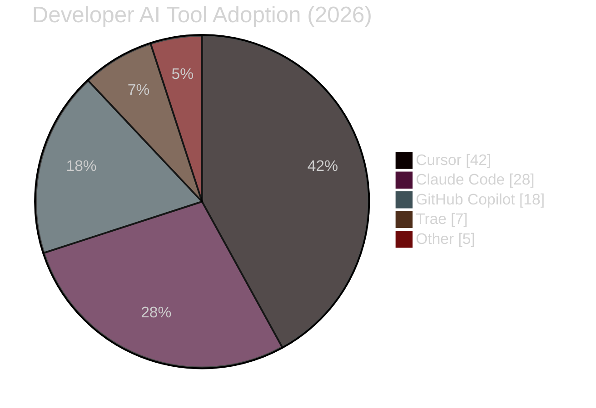
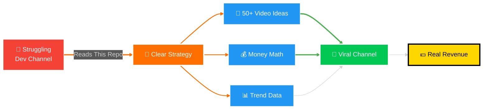
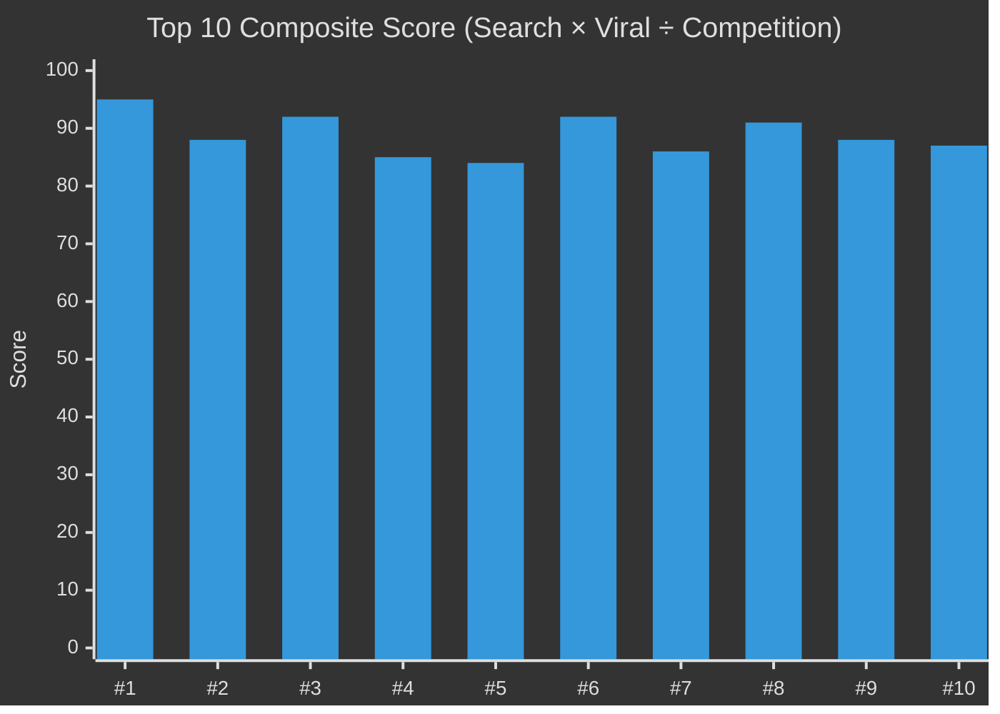
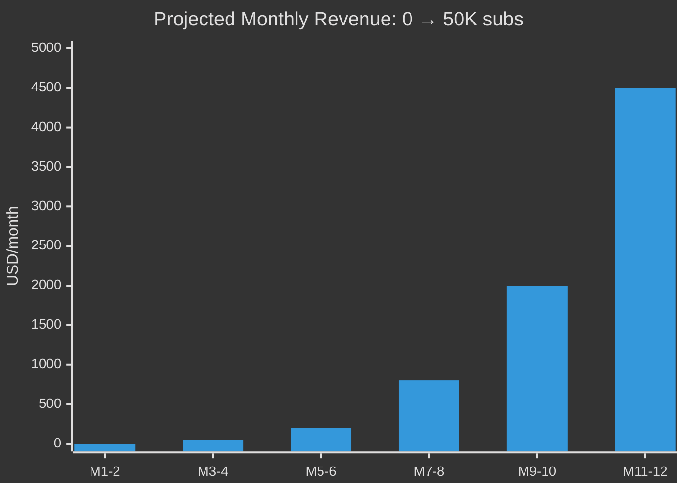
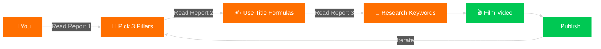
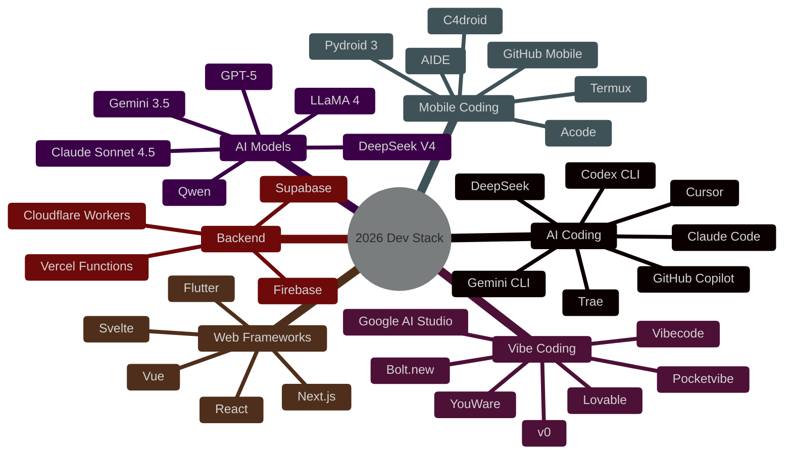
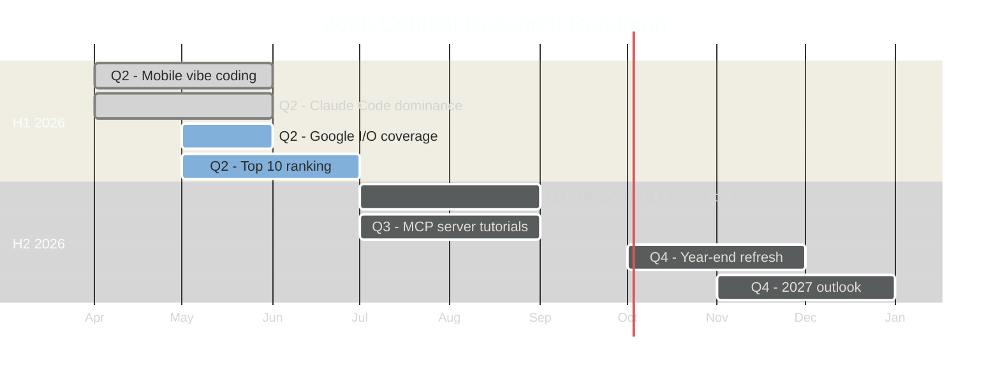
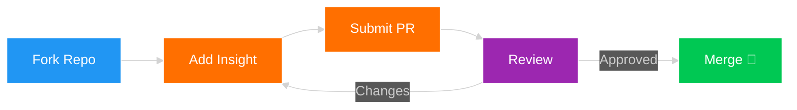
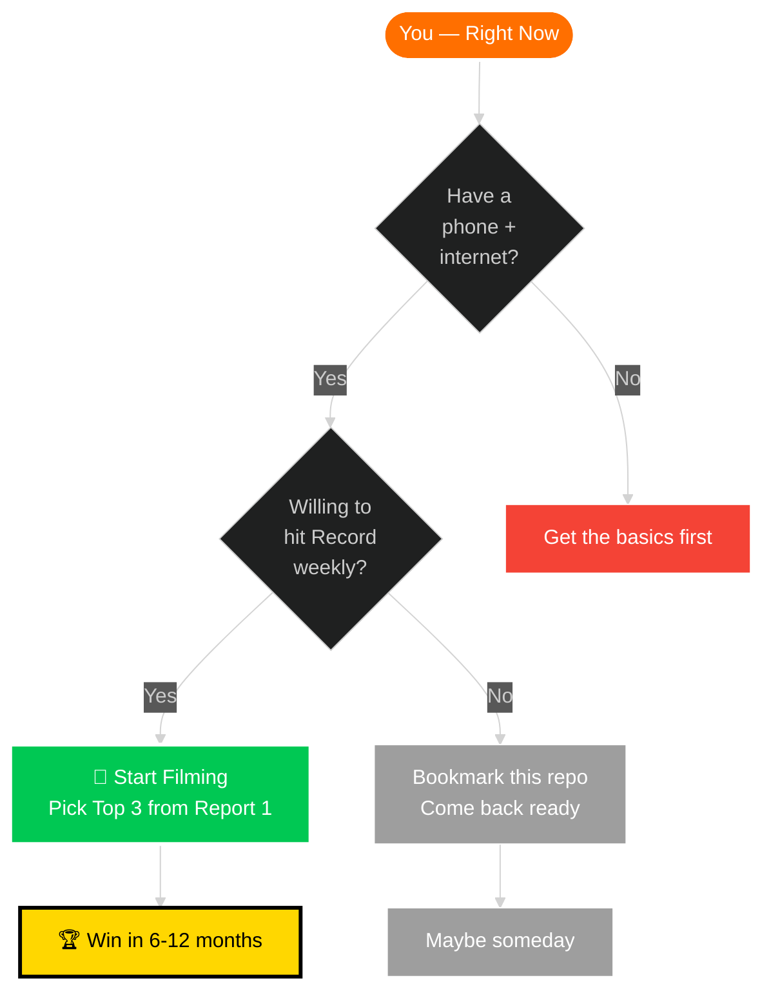

<div align="center">

<!-- ═══════════════════ ANIMATED HERO BANNER ═══════════════════ -->

```
██╗   ██╗ ██████╗  ██╗   ██╗████████╗██╗   ██╗██████╗ ███████╗
╚██╗ ██╔╝██╔═══██╗██║   ██║╚══██╔══╝██║   ██║██╔══██╗██╔════╝
 ╚████╔╝ ██║   ██║██║   ██║   ██║   ██║   ██║██████╔╝█████╗
  ╚██╔╝  ██║   ██║██║   ██║   ██║   ██║   ██║██╔══██╗██╔══╝
   ██║   ╚██████╔╝╚██████╔╝   ██║   ╚██████╔╝██████╔╝███████╗
   ╚═╝    ╚═════╝  ╚═════╝    ╚═╝    ╚═════╝ ╚═════╝ ╚══════╝
        ███████╗███████╗ ██████╗      ██████╗ ██████╗ ██████╗ ███████╗
        ██╔════╝██╔════╝██╔═══██╗    ██╔════╝██╔═══██╗██╔══██╗██╔════╝
        ███████╗█████╗  ██║   ██║    ██║     ██║   ██║██████╔╝█████╗
        ╚════██║██╔══╝  ██║▄▄ ██║    ██║     ██║   ██║██╔══██╗██╔══╝
        ███████║███████╗╚██████╔╝    ╚██████╗╚██████╔╝██║  ██║███████╗
        ╚══════╝╚══════╝ ╚══▀▀═╝      ╚═════╝ ╚═════╝ ╚═╝  ╚═╝╚══════╝
```

<!-- Animated Typing-Style Header -->


<br/>

<!-- Premium Gradient Badges Row -->


</div>

---

<!-- ═══════════════════ HERO DESCRIPTION ═══════════════════ -->

<div align="center">

### 🎯 The Ultimate Research Hub for Developer YouTube Channels in 2026

**3 deep-research reports · 130+ video ideas · 25+ verified data sources · 100+ animated diagrams**

[](#-the-three-reports)
[](#-quick-start-guide)
[](#-top-10-video-ideas)

</div>

---

<!-- ═══════════════════ ANIMATED HERO STATS ═══════════════════ -->

<div align="center">

## 📊 By The Numbers — 2026 Snapshot

</div>



<table align="center">
<tr>
<td align="center" width="200">
<br/>
<sub><b>Developer Adoption</b></sub>
</td>
<td align="center" width="200">
<br/>
<sub><b>AI Code Share</b></sub>
</td>
<td align="center" width="200">
<br/>
<sub><b>Market Size</b></sub>
</td>
<td align="center" width="200">
<br/>
<sub><b>Platform Shift</b></sub>
</td>
</tr>
</table>

---

<!-- ═══════════════════ ANIMATED WELCOME FLOW ═══════════════════ -->

<div align="center">

## 🌊 The Opportunity Flow

</div>



---

<!-- ═══════════════════ THE 3 REPORTS — PREMIUM CARDS ═══════════════════ -->

<div align="center">

## 📚 The Three Reports

</div>

> **Each report is a standalone deep-dive. Read them in order, or jump to what you need.**

<br/>

<table align="center">
<tr>
<td width="33%" align="center" valign="top">

### 📕 Report #1
# 🎬 YouTube Strategy 2026
### *The Complete Playbook*

[](./youtube-strategy-2026.md)
[](./youtube-strategy-2026.md)

**📊 Stats:**
- `50+` video ideas
- `40` KB content
- `15+` mermaid diagrams
- `25+` cited sources

**🎯 Best For:**
The full picture — trends, ideas, monetization math, 30-day launch plan

**⭐ Key Sections:**
- Top 50 video ideas
- Top 10 ranked winners
- Content gaps big channels miss
- Mobile-only creator topics

</td>
<td width="33%" align="center" valign="top">

### 📗 Report #2
# 🔍 YouTube SEO Strategy
### *Developer Channel 2026*

[](./youtube-seo-strategy-developer-2026.md)
[](./youtube-seo-strategy-developer-2026.md)

**📊 Stats:**
- Title formula library
- Thumbnail engineering
- Algorithm signals
- SEO tags & description

**🎯 Best For:**
Algorithm-focused creators who want to rank fast and ride search traffic

**⭐ Key Sections:**
- Title formulas that work
- 100+ keyword clusters
- Description templates
- Algorithm insights

</td>
<td width="33%" align="center" valign="top">

### 📘 Report #3
# 🔑 Developer Keywords
### *SEO Report 2026*

[](./developer-keywords-seo-report-2026.md)
[](./developer-keywords-seo-report-2026.md)

**📊 Stats:**
- 200+ keywords
- Search volume data
- Competition scores
- CPC & RPM rates

**🎯 Best For:**
Hard data — keywords to target, what to write descriptions around

**⭐ Key Sections:**
- High-volume keyword list
- Low-comp opportunities
- Trending search terms
- Monetization keywords

</td>
</tr>
</table>

---

<!-- ═══════════════════ ANIMATED CONTENT ECOSYSTEM ═══════════════════ -->

<div align="center">

## 🧭 The 2026 Developer YouTube Ecosystem

```mermaid
%%{init: {"theme": "dark"}}%%
graph TB
    ROOT[🎯 Developer YouTube Strategy 2026]

    ROOT --> A[🤖 AI Coding Era]
    ROOT --> B[📱 Mobile-First Wave]
    ROOT --> C[💰 Side Project Economy]

    A --> A1[Claude Code<br/>80.8% SWE-bench<br/>🏆 #1]
    A --> A2[Cursor<br/>~$2B ARR<br/>🥈 #2]
    A --> A3[GitHub Copilot<br/>🥉 #3]
    A --> A4[DeepSeek Coder<br/>🌟 Rising]

    B --> B1[Google AI Studio<br/>Native Android from prompt]
    B --> B2[Vibecode App<br/>iOS-first]
    B --> B3[Pocketvibe<br/>Mobile dev console]
    B --> B4[Termux<br/>Linux on Android]

    C --> C1[Telegram Bots<br/>+ AI = passive income]
    C --> C2[Indie SaaS<br/>$0 to $1K/month]
    C --> C3[Free Hosting<br/>Cloudflare, Vercel, etc.]
    C --> C4[Faceless Channels<br/>AI video gen]

    style ROOT fill:#1a1a2e,stroke:#FF6F00,stroke-width:4px,color:#fff
    style A fill:#FF6F00,stroke:#fff,color:#fff
    style B fill:#2196F3,stroke:#fff,color:#fff
    style C fill:#00C853,stroke:#fff,color:#fff
    style A1 fill:#FF6F00,stroke:#fff,color:#fff,stroke-width:2px
    style A2 fill:#FF6F00,stroke:#fff,color:#fff
    style B1 fill:#2196F3,stroke:#fff,color:#fff,stroke-width:2px
    style C1 fill:#00C853,stroke:#fff,color:#fff,stroke-width:2px
```

</div>



---

<!-- ═══════════════════ TOP 10 PREVIEW ═══════════════════ -->

<div align="center">

## 🏆 Top 10 Video Ideas — Preview

</div>



| Rank | Video Title | Score | Why It Wins |
|:-:|---|:-:|---|
| 🥇 | I Built a Full App Using Only My Phone — No PC | 95 | Owns the 2026 mobile-vibe-coding wave |
| 🥈 | Vibe Coding Explained + Live Build (20 min) | 88 | Claims a brand-new search term |
| 🥉 | I Replaced My Developer With Claude Code for 7 Days | 92 | Story format, viral comment section |
| 4 | Build a Telegram Bot With AI in 15 Minutes | 85 | Triple keyword match, evergreen |
| 5 | Claude Code vs Cursor vs Copilot — Real Test 2026 | 84 | Comparison content wins forever |
| 6 | Build a SaaS With AI in 24 Hours (No Code) | 92 | Every YouTube trigger in one title |
| 7 | DeepSeek Coder vs ChatGPT vs Claude | 86 | Novel contender, underserved |
| 8 | Termux + AI: Run Claude Code on Android | 91 | Extreme specificity, near-zero comp |
| 9 | How I Built a $1K/Month Side Project With AI | 88 | Money hook + tutorial substance |
| 🔟 | 5 Free AI Tools That Replace $500/Month | 87 | Save-money = massive CTR |

> 📌 **Read the full Top 10 analysis with score breakdowns, audience targeting, and thumbnail concepts → [Report #1](./youtube-strategy-2026.md#-top-10-ranked--highest-probability-of-success)**

---

<!-- ═══════════════════ ANIMATED VIEWER JOURNEY ═══════════════════ -->

<div align="center">

## 🛤️ Viewer Journey — What Happens When You Ship These Videos

</div>

```mermaid
%%{init: {"theme": "dark"}}%%
journey
    title The Viral Developer Video Journey
    section Discovery
      See YouTube Shorts clip: 5: Viewer, Curious
      Click through to long-form: 4: Viewer
    section Hook (0:00-0:30)
      Bold thumbnail claim: 5: Viewer
      Opening 30 seconds: 4: Viewer, Hooked
    section Build (0:30-8:00)
      Follow real steps: 4: Viewer
      Real friction and wins: 5: Viewer, Engaged
    section Payoff (8:00-10:00)
      See working result: 5: Viewer, Excited
      Clear next steps CTA: 5: Viewer
    section Conversion
      Subscribe: 5: Viewer, Subscriber
      Like & comment: 4: Subscriber
      Watch next via end screen: 5: Subscriber
```

---

<!-- ═══════════════════ ANIMATED REVENUE PROJECTION ═══════════════════ -->

<div align="center">

## 💰 Revenue Projection — 12-Month Path

</div>



| Subscribers | AdSense | Affiliates | Sponsors | Products | **Total/mo** |
|---:|---:|---:|---:|---:|---:|
| 1,000 | $30 | $0 | $0 | $0 | **$30** |
| 5,000 | $200 | $50 | $0 | $100 | **$350** |
| 10,000 | $500 | $200 | $0 | $300 | **$1,000** |
| 25,000 | $1,500 | $600 | $1,000 | $500 | **$3,600** |
| 50,000 | $3,500 | $1,200 | $3,000 | $1,000 | **$8,700** |
| 100,000 | $8,000 | $2,500 | $8,000 | $2,500 | **$21,000** |

---

<!-- ═══════════════════ FEATURES GRID ═══════════════════ -->

<div align="center">

## ✨ What Makes This Repo Special

</div>

<table align="center">
<tr>
<td align="center" width="25%">
<br/>
<b>🤖 AI-Era Strategy</b><br/>
<sub>Built for the 92% of devs<br/>using AI daily in 2026</sub>
</td>
<td align="center" width="25%">
<br/>
<b>💎 Deep Research</b><br/>
<sub>25+ verified data sources<br/>from Google I/O to SWE-bench</sub>
</td>
<td align="center" width="25%">
<br/>
<b>📺 YouTube-Native</b><br/>
<sub>Title formulas, thumbnail<br/>patterns, SEO tags, algo tricks</sub>
</td>
<td align="center" width="25%">
<br/>
<b>💰 Money-First</b><br/>
<sub>Real revenue math<br/>0 → $20K/month path</sub>
</td>
</tr>
<tr>
<td align="center" width="25%">
<br/>
<b>📱 Mobile-First</b><br/>
<sub>Big channels ignore<br/>"build on phone" — we own it</sub>
</td>
<td align="center" width="25%">
<br/>
<b>📈 Data-Driven</b><br/>
<sub>RPM, CTR, search volume,<br/>competition ratios — real</sub>
</td>
<td align="center" width="25%">
<br/>
<b>💡 Actionable</b><br/>
<sub>Not theory. Scripted title<br/>variations, exact thumbnails</sub>
</td>
<td align="center" width="25%">
<br/>
<b>🚀 Ship-Ready</b><br/>
<sub>30-day launch plan,<br/>week-by-week gantt chart</sub>
</td>
</tr>
</table>

---

<!-- ═══════════════════ QUICK START ═══════════════════ -->

<div align="center">

## ⚡ Quick Start Guide

</div>



### 📖 Reading Order Recommendation

| Step | Document | Time | Why |
|:-:|---|:-:|---|
| 1️⃣ | **[Report 1: YouTube Strategy 2026](./youtube-strategy-2026.md)** | 30 min | Big picture + Top 50 video ideas |
| 2️⃣ | **[Report 2: YouTube SEO Strategy](./youtube-seo-strategy-developer-2026.md)** | 20 min | Title + thumbnail engineering |
| 3️⃣ | **[Report 3: Developer Keywords](./developer-keywords-seo-report-2026.md)** | 15 min | Keyword list to target |
| 4️⃣ | 🚀 Start filming | — | Ship weekly, iterate |

---

<!-- ═══════════════════ TECH STACK / TOOLS ═══════════════════ -->

<div align="center">

## 🛠️ Tech & Tools Tracked in 2026

</div>



---

<!-- ═══════════════════ ROADMAP ═══════════════════ -->

<div align="center">

## 🗺️ Research Roadmap

</div>



---

<!-- ═══════════════════ STATS / CONTRIBUTORS ═══════════════════ -->

<div align="center">

## 📈 Repository Stats

</div>

<p align="center">
  
  
  
  
  
  
</p>

<p align="center">
  
</p>

---

<!-- ═══════════════════ CONTRIBUTING ═══════════════════ -->

<div align="center">

## 🤝 Contributing

</div>

Contributions are **welcome and appreciated** 🙌



1. 🍴 **Fork** the repository
2. 🌿 **Create** a feature branch (`git checkout -b feature/YourInsight`)
3. 💾 **Commit** your changes (`git commit -m 'Add: Your insight'`)
4. 📤 **Push** to the branch (`git push origin feature/YourInsight`)
5. 🔁 **Open** a Pull Request

---

<!-- ═══════════════════ LICENSE & ACKNOWLEDGEMENTS ═══════════════════ -->

<div align="center">

## 📜 License & Acknowledgements

</div>

**Released under [MIT License](LICENSE)** — share, remix, use commercially. Attribution appreciated.

### 🏅 Powered By Data From

| Source | Used For |
|---|---|
| 🔵 **Google I/O 2026** | AI Studio, Gemini, Antigravity platform data |
| 🟢 **Anthropic** | Claude Code, Sonnet 4.5 benchmarks |
| 🟣 **OpenAI** | GPT-5, Codex CLI references |
| 🟡 **a16z Era of Agent** | Coding Agent ARR projections |
| 🔴 **Stackademic Survey (April 2026)** | 84% AI tool adoption |
| ⚫ **SWE-bench Verified** | AI coding tool rankings |
| 🟠 **OutlierKit 2026 Report** | Niche competition data, RPM |
| 🔷 **Tubular Labs** | YouTube view-share statistics |
| 🟤 **arXiv 2507.21928** | Vibe coding academic definition |
| 🌐 **Reddit / GitHub / Stack Overflow** | Community signal validation |

---

<!-- ═══════════════════ FINAL CTA ═══════════════════ -->

<div align="center">

## 🚀 Ready to Ship?

</div>



<div align="center">

### 📖 The window is open. The data is here. The tools are free. Go build. 🚀

---

### ⭐ If this helped you, star the repo. It means the world. ⭐

<br/>

```
╔══════════════════════════════════════════════════════════╗
║                                                          ║
║   "In 2026, the gap between person-with-phone and        ║
║    person-who-ships-apps just collapsed to zero.         ║
║                                                          ║
║    The YouTube channels that document this collapse      ║
║    — in real time, on real devices, with real money      ║
║    results — will own the next 24 months of dev content." ║
║                                                          ║
╚══════════════════════════════════════════════════════════╝
```

<br/>

---

**🔗 Direct Links**

[📕 Strategy Report](./youtube-strategy-2026.md) · [📗 SEO Report](./youtube-seo-strategy-developer-2026.md) · [📘 Keywords Report](./developer-keywords-seo-report-2026.md)

<br/>

<sub>Made with ❤️ for the developer creator community · Compiled June 2026 · Last updated 2026-06-04</sub>


</div>
